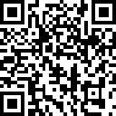

<p align="center">
    
</p>

# NetBarcode  

Barcode generation library written in .NET Core compatible with .NET Standard 2.

## Supported barcodes:

* CODE128
  * CODE128 (automatic mode switching)
  * CODE128 A/B/C
* EAN
  * EAN-13
  * EAN-8
* CODE11
* CODE39
* CODE39E
* CODE93
* Codabar

## Install

On Nuget:
```
PM> Install-Package NetBarcode
```

.NET CLI
```
> dotnet add package NetBarcode
```

## NuGet
https://www.nuget.org/packages/NetBarcode

## Requirements
This library uses `System.Drawing.Common` which requires the following installed packages:
```
sudo apt install libc6-dev 
sudo apt install libgdiplus
```
Mac
```
brew update
brew install mono-libgdiplus
```

## Using

``` c#
var barcode = new Barcode("543534"); // default: Code128
```
Change barcode type
``` c#
var barcode = new Barcode("543534", Type.Code93);
```
Show label
``` c#
var barcode = new Barcode("543534", Type.Code128, true);
```
Saving in a image file
``` c#
var value = barcode.SaveImageFile("./path"); // default: ImageFormat.Jpeg
```
Change image format
``` c#
var value = barcode.SaveImageFile("./path", ImageFormat.Png); // formats: Bmp, Gif, Jpeg, Png...
```
Get string with base64 image to use in HTML
``` c#
var value = barcode.GetBase64Image();
```
To manipulate the image
``` c#
var image = barcode.GetImage();
```

## Version 1.5
ImageSharp was added in place of System.Drawing due to break of support from .NET 6, more information [click here](https://docs.microsoft.com/en-us/dotnet/core/compatibility/core-libraries/6.0/system-drawing-common-windows-only).
There is a small compatibility break only if you are manipulating the image with the GetImage method or customizing font and color. In these cases the namespaces have changed to `SixLabors.ImageSharp`.

## License

NetBarcode is shared under the MIT license. This means you can modify and use it however you want, even for comercial use. But please give this repository a ⭐️.

## Donate
If you found it useful, please consider paying me a coffee.

[](https://www.paypal.com/donate?hosted_button_id=D42N6KUH47YHW)


