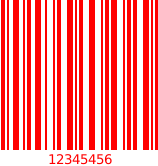
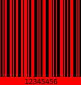
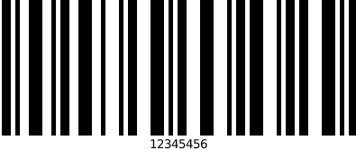
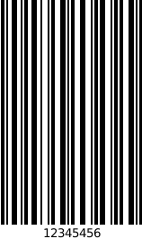
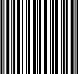
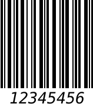
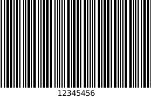
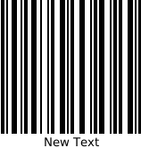
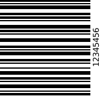

<p align="center">
    
</p>

# NetBarcode 

Barcode generation library written in .NET Core compatible with .NET Standard 2.

## Supported barcodes:

* CODE128
  * CODE128 (automatic mode switching)
  * CODE128 A/B/C
* EAN
  * EAN-13
  * EAN-8
* CODE11
* CODE39
* CODE39E
* CODE93
* Codabar

## Install

On Nuget:
```
PM> Install-Package NetBarcode
```

.NET CLI
```
> dotnet add package NetBarcode
```

## Requirements
This library uses `System.Drawing.Common` which requires the following installed packages:
```
sudo apt install libc6-dev 
sudo apt install libgdiplus
```

## Usage/Examples

Set configs
```c#
var barcode = new Barcode();
barcode.Configure(settings =>
{
    BackgroundColor = Color.Crimson
});
```
or
```c#
var barcode = new Barcode();
barcode.Configure(new BarcodeSettings
{
    BackgroundColor = Color.Crimson
});
```
Use defaults
```c#
var barcode = new Barcode();
barcode.SaveImageFile("12345456", "barcode.png");
```
Change barcode type
```c#
var barcode = new Barcode();
barcode.Configure(settings =>
{
    settings.BarcodeType = BarcodeType.Code39E;
}).SaveImageFile("12345456", "barcode.png");
```

## Output options

Image file `void SaveImageFile(string data, string path, ImageFormat imageFormat = null)`
```c#
var barcode = new Barcode();
barcode.SaveImageFile("12345456", "barcode.png", ImageFormat.Jpeg);
```
Base64 image `string GetBase64Image(string data, ImageFormat imageFormat = null)`
```c#
var barcode = new Barcode();
barcode.GetBase64Image("12345456", ImageFormat.Jpeg);
```
Byte array image `byte[] GetByteArray(string data, ImageFormat imageFormat = null)`
```c#
var barcode = new Barcode();
barcode.GetByteArray("12345456", ImageFormat.Jpeg);
```
Bitmap class `Bitmap GetImage(string data)`
```c#
var barcode = new Barcode();
barcode.GetImage("12345456");
```

## Options
| Option | Default value | Type |
|--------|---------------|------|
| [LineColor](#linecolor) | `Black` | `Color` |
| [BackgroundColor](#backgroundcolor) | `White` | `Color` |
| [BarWidth](#barwidth) | `2` | `int` |
| [BarcodeHeight](#barcodeheight) | `150` | `int` |
| [ShowLabel](#showlabel) | `true` | `bool` |
| [LabelFont](#labelfont) | `Font(FontFamily.GenericMonospace, 10, FontStyle.Regular)` | `Font` |
| [LabelPosition](#labelposition) | `BottomCenter` | `LabelPosition` |
| [BarcodeType](#barcodetype) | `"auto" (CODE128)` | `BarcodeType` |
| [Text](#text) |  | `string` |
| [Rotate](#rotate) | `RotateNoneFlipNone` | `RotateFlipType` |

### LineColor
```c#
var barcode = new Barcode();
barcode.Configure(new BarcodeSettings
{
    LineColor = Color.Red
});
```


### BackgroundColor
```c#
var barcode = new Barcode();
barcode.Configure(new BarcodeSettings
{
    BackgroundColor = Color.Red
});
```


### BarWidth
```c#
var barcode = new Barcode();
barcode.Configure(new BarcodeSettings
{
    BarWidth = 5
});
```


### BarcodeHeight
```c#
var barcode = new Barcode();
barcode.Configure(new BarcodeSettings
{
    BarcodeHeight = 250
});
```


### ShowLabel
```c#
var barcode = new Barcode();
barcode.Configure(new BarcodeSettings
{
    ShowLabel = false
});
```


### LabelFont
```c#
var barcode = new Barcode();
barcode.Configure(new BarcodeSettings
{
    LabelFont = new Font(FontFamily.GenericMonospace, 20, FontStyle.Italic)
});
```


### LabelPosition
```c#
var barcode = new Barcode();
barcode.Configure(new BarcodeSettings
{
    LabelPosition = LabelPosition.TopCenter
});
```


### BarcodeType
```c#
var barcode = new Barcode();
barcode.Configure(new BarcodeSettings
{
    BarcodeType = BarcodeType.Code39E
});
```


### Text
```c#
var barcode = new Barcode();
barcode.Configure(new BarcodeSettings
{
    Text = "New Text"
});
```


### Rotate
```c#
var barcode = new Barcode();
barcode.Configure(new BarcodeSettings
{
    Rotate = RotateFlipType.Rotate90FlipXY
});
```


## License

NetBarcode is shared under the MIT license. This means you can modify and use it however you want, even for comercial use. But please give this repository a ⭐️.

## Donate
If you found it useful, please consider paying me a coffee.

[](https://www.paypal.com/donate?hosted_button_id=D42N6KUH47YHW)

